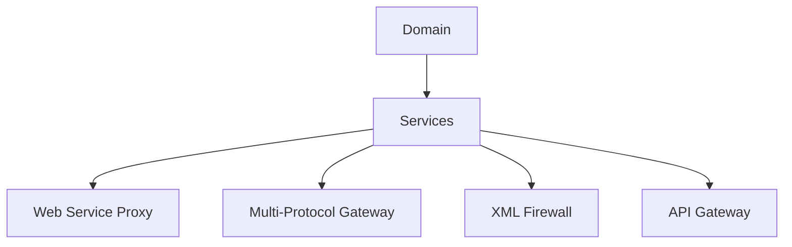
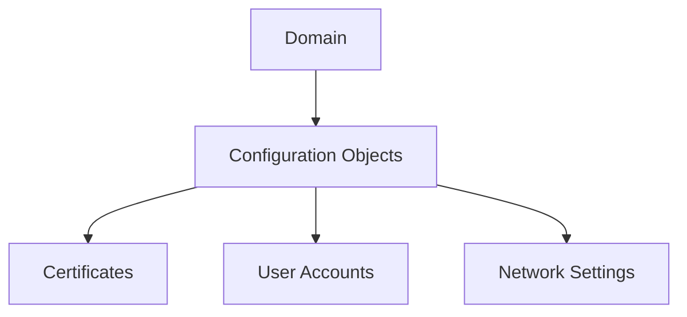
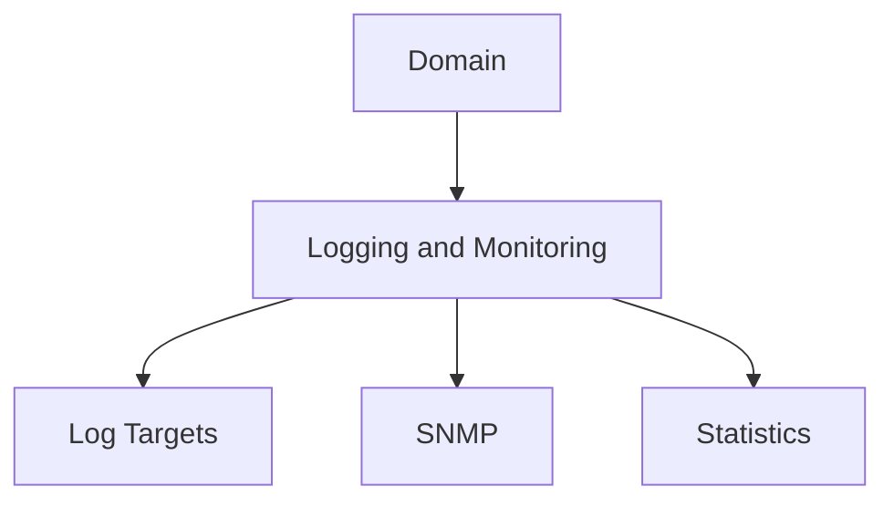
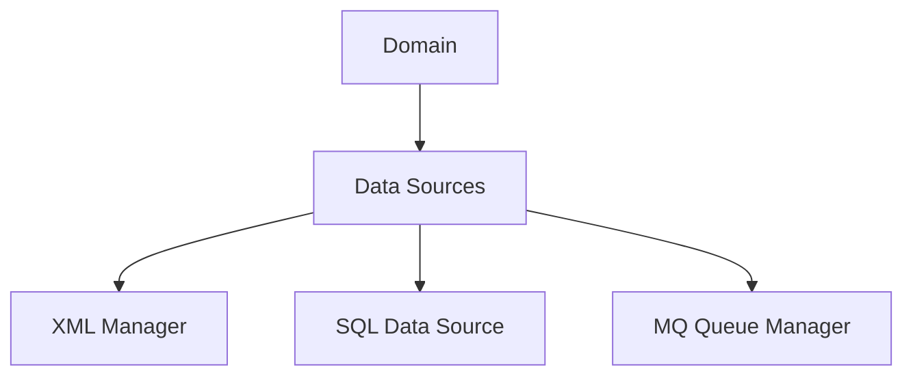
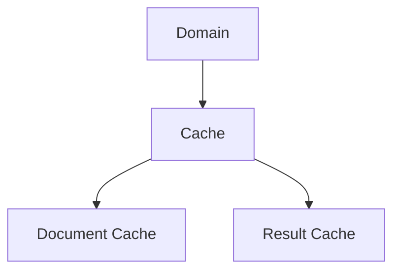

# Domain Architecture

## Services

```mermaid
graph TD
    A[Domain] --> B[Services]
    B --> B1[Web Service Proxy]
    B --> B2[Multi-Protocol Gateway]
    B --> B3[XML Firewall]
    B --> B4[API Gateway]
```

## Policies

```mermaid
graph TD
    A[Domain] --> C[Policies]
    C --> C1[Security Policies]
    C --> C2[Routing Policies]
    C --> C3[Transformation Policies]
```

## Configuration Objects

```mermaid
graph TD
    A[Domain] --> D[Configuration Objects]
    D --> D1[Certificates]
    D --> D2[User Accounts]
    D --> D3[Network Settings]
```

## Loggin and Monitoring

```mermaid
graph TD
    A[Domain] --> E[Logging and Monitoring]
    E --> E1[Log Targets]
    E --> E2[SNMP]
    E --> E3[Statistics]
```

## Data Sources

```mermaid
graph TD
    A[Domain] --> F[Data Sources]
    F --> F1[XML Manager]
    F --> F2[SQL Data Source]
    F --> F3[MQ Queue Manager]
```

## Cache

```mermaid
graph TD
    A[Domain] --> G[Cache]
    G --> G1[Document Cache]
    G --> G2[Result Cache]
```