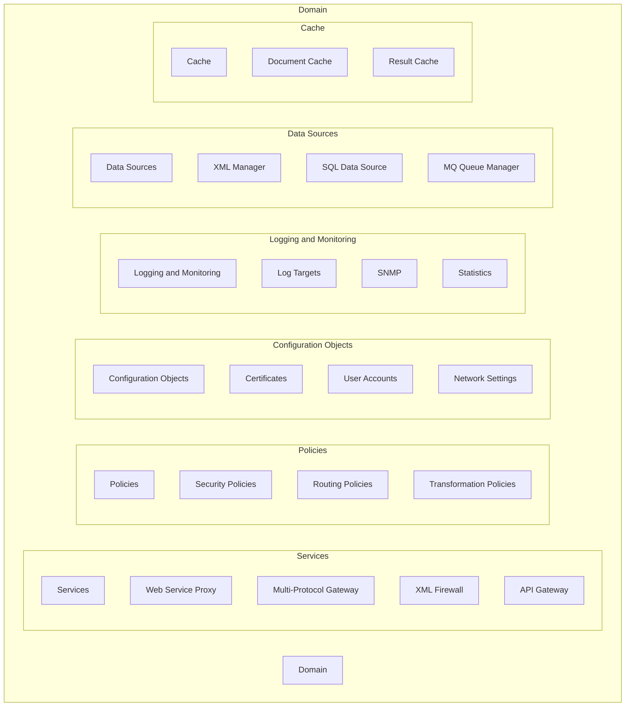

### Domains

Components of a domain in DataPower


### Option 3: Use Subgraphs

You can use subgraphs to group related nodes together, making the diagram more organized and easier to read.

#### Example:

```markdown
### Domains

