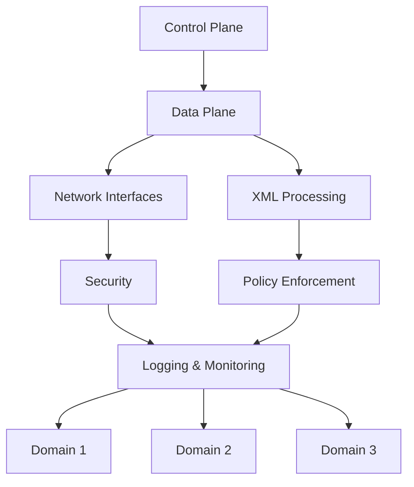

# DataPower Docs Base

Components of DataPower

```mermaid
graph TD
    A[Control Plane] --> B[Data Plane]
    B --> C[Network Interfaces]
    B --> D[XML Processing]
    C --> E[Security]
    D --> F[Policy Enforcement]
    E --> G[Logging & Monitoring]
    F --> G
    G --> H[Domain 1]
    G --> I[Domain 2]
    G --> J[Domain 3]
```